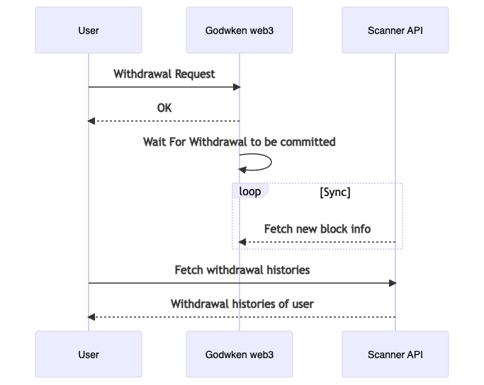
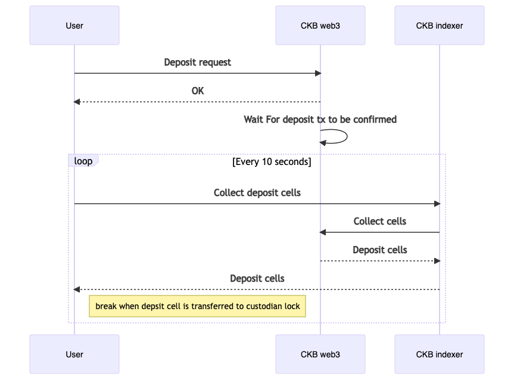

# How to Move Asset between Godwoken(Layer 2) and CKB(Layer 1)

- basic knowledge of [godwoken](https://www.nervos.org/godwoken) layer 2 network
- basic knowledge of [ckb](https://docs.nervos.org/docs/basics/introduction) and ckb [transaction](https://docs.nervos.org/docs/reference/transaction)

The workflow of withdrawing assets from a layer 2 address to a layer 1 address depend on the Godwoken web3 service and the Scaner API Service:



## Submit Withdrawal Request to Godwoken

The first step is to call [gw_submit_withdrawal_request](https://github.com/nervosnetwork/godwoken/blob/develop/docs/RPC.md#method-gw_submit_withdrawal_request) RPC method to burn assets on layer 2 chain
and in the meantime, Godwoken creates the assets on layer 1 which can later be unlocked by the receiver address.
Note that when making such a request you need to provide some info as parameters,

```json5
{
  raw: {
    nonce: "0x2e", // from [get_nonce](https://github.com/nervosnetwork/godwoken/blob/develop/docs/RPC.md#method-gw_get_nonce)
    capacity: "0x9502f9000", // amount of ckb to withdraw in shannon unit
    amount: "0x0", // amount of sUDT to withdraw, default to 0x0 if you don't need to withdraw sUDT
    sudt_script_hash: "0x0000000000000000000000000000000000000000000000000000000000000000", // l1 SUDT script hash, default to all zero if you don't need to withdraw sUDT
    account_script_hash: "0x1ddfd18bee966192f8e35e8fbaaae93b88c476960754077d039cf1e56c633c22", // withdrawer layer 2 ckb account lock hash, layer 2 address -> layer 2 lock script -> lock hash
    sell_amount: "0x0", // TODO unimplemented, selling price of the withdrawal cell in CKB
    sell_capacity: "0x0", // TODO unimplemented, selling price of the withdrawal cell in SUDT
    owner_lock_hash: "0xfda77156f5ec403242a03875b2b29e14ba1c910b14a62fbe0baa3e367ae1f0a6", // owner ckb account lock hash, layer 1 address -> lock script -> lock hash
    payment_lock_hash: "0x0000000000000000000000000000000000000000000000000000000000000000", // TODO unimplemented, layer1 lock to receive the payment, must exists on the chain
    fee: {
      sudt_id: "0x1",
      amount: "0x0",
    },
  },
  signature: "0x8109666e73e8e2ce0bc95d95e08a3a77844c9c5e8049882d863c765843f14af57107bf22c00bce8ea1e45cdbc85415d4f497061913bcbfa97258b2b27897a53a01",
}
```

### `owner_lock_hash` And `account_script_hash`

In the example above

- `owner_lock_hash`'s `owner` indicates the owner of layer 1
- `account_script_hash`'s `account` indicates the `address` of layer 2

To calc the hashes, we can see the sample code below

```ts
import { utils, helpers } from "@ckb-lumos/lumos";

// layer 1 receiver lock
const ownerLock = helpers.parseAddress(owner /* a CKB address like ckt1... */);
const owner_lock_hash = utils.computeScriptHash(ownerLock);

// layer 2 account
const l2AccountScript: Script = {
  code_hash: ethAccountTypeHash,
  hash_type: "type",
  args: rollupTypeHash + l2Address.slice(2),
};
const account_script_hash = utils.computeScriptHash(l2AccountScript);
```

Once you have successfully submitted the RPC request, the return hash value can be used to query the state of withdrawal by calling [gw_get_withdrawal](https://github.com/nervosnetwork/godwoken/blob/develop/docs/RPC.md#method-gw_get_withdrawal) method:

```JSON
{
  "id": 2,
  "jsonrpc": "2.0",
  "method": "gw_get_withdrawal",
  "params": ["0xb57c6da2f803413b5781f8c6508320a0ada61a2992bb59ab38f16da2d02099c1"]
}
```

the return value should look like:

<details>
  <summary markdown="span">return value of gw_get_withdrawal</summary>

```JSON
{
  "jsonrpc": "2.0",
  "id": 2,
  "result": {
    "withdrawal": {
      "raw": {
        "nonce": "0x2e",
        "capacity": "0x9502f9000",
        "amount": "0x0",
        "sell_amount": "0x0",
        "sell_capacity": "0x0",
        "sudt_script_hash": "0x0000000000000000000000000000000000000000000000000000000000000000",
        "account_script_hash": "0x1ddfd18bee966192f8e35e8fbaaae93b88c476960754077d039cf1e56c633c22",
        "owner_lock_hash": "0xfda77156f5ec403242a03875b2b29e14ba1c910b14a62fbe0baa3e367ae1f0a6",
        "payment_lock_hash": "0x0000000000000000000000000000000000000000000000000000000000000000",
        "fee": {
          "sudt_id": "0x1",
          "amount": "0x0"
        }
      },
      "signature": "0x8109666e73e8e2ce0bc95d95e08a3a77844c9c5e8049882d863c765843f14af57107bf22c00bce8ea1e45cdbc85415d4f497061913bcbfa97258b2b27897a53a01"
    },
    "status": "committed"
  }
}
```

</details>

The `status` field could be `pending` or `committed`, indicating the different status of the withdrawal.

Then a cell containing the assets is created on layer 1, to list all withdrawal cells requested by a layer 2 account, let's name it `AliceL2`, we can make a query using `@ckb-lumos/ckb-indexer` like this:

```ts
const getWithdrawalCellSearchParams = function (AliceL2: string) {
  const layer2Lock: Script = {
    code_hash: SCRIPTS.eth_account_lock.script_type_hash,
    hash_type: "type",
    args: ROLLUP_CONFIG.rollup_type_hash + AliceL2.slice(2).toLowerCase(),
  };
  const accountScriptHash = utils.computeScriptHash(layer2Lock);

  return {
    script: {
      code_hash: SCRIPTS.withdrawal_lock.script_type_hash,
      hash_type: "type" as HashType,
      args: `${ROLLUP_CONFIG.rollup_type_hash}${accountScriptHash.slice(2)}`,
    },
    script_type: "lock",
  };
};
const searchParams = getWithdrawalCellSearchParams(AliceL2);
const collector = ckbIndexer.collector({ lock: searchParams.script });
```

### List Withdrawals

The Scanner API provides a method to fetch withdrwals list.

```sh
curl --location --request GET 'https://api.aggron.gwscan.com/api/withdrawal_histories?owner_lock_hash=<Your Owner Lock Hash>'
```

<details>
  <summary markdown="span">sample return value of withdrawal_histories</summary>

```JSON
{
    "data": [
        {
            "attributes": {
                "amount": "72100000000",
                "block_hash": "0x839e577623b90dc406bd18777f9827269a09a8d622a0d439a961315648285dd3",
                "block_number": 362820,
                "capacity": "72100000000",
                "is_fast_withdrawal": false,
                "l2_script_hash": "0x1ddfd18bee966192f8e35e8fbaaae93b88c476960754077d039cf1e56c633c22",
                "layer1_block_number": 5259967,
                "layer1_output_index": 66,
                "layer1_tx_hash": "0xba70322ac9c91a3bc93f515e5f346a9df8741008b474b85a465a2de2467c66c4",
                "owner_lock_hash": "0xfda77156f5ec403242a03875b2b29e14ba1c910b14a62fbe0baa3e367ae1f0a6",
                "payment_lock_hash": "0x0000000000000000000000000000000000000000000000000000000000000000",
                "sell_amount": "0",
                "sell_capacity": "0",
                "state": "succeed",
                "timestamp": "2022-05-05T02:17:59.091000Z",
                "udt_id": 1,
                "udt_script_hash": "0x0000000000000000000000000000000000000000000000000000000000000000"
            },
            "id": "394079",
            "relationships": {
                "udt": {
                    "data": {
                        "id": "1",
                        "type": "udt"
                    }
                }
            },
            "type": "withdrawal_history"
        }
    ]
}
```

</details>

### Deposit asset to Godwoken
The workflow of deposit depend on the CKB web3 service and the CKB indexer Service:



All you need to do is to forge a tx to transfer assets to this deposit lock:

```json5
{
  "code_hash": <deposit lock code_hash>
  "hash_type": <deposit lock hash_type>
  "args": <Your deposit lock args>
}
```

The deposit lock args structure is declared [here](https://github.com/nervosnetwork/godwoken/blob/develop/crates/types/schemas/godwoken.mol#L175-L183) as:

```json5
// --- deposit lock ---
// a rollup_type_hash exists before this args, to make args friendly to prefix search
table DepositLockArgs {
    // layer1 lock hash
    owner_lock_hash: Byte32,
    layer2_lock: Script,
    cancel_timeout: Uint64, // v0/v1 has different min cancel_timeout, please refer to godwoken docs
    registry_id: Uint32, // only v1
}
```

## Reference

- [Godwoken Docs](https://github.com/nervosnetwork/godwoken/blob/develop/docs/RPC.md#method-gw_submit_withdrawal_request)
- [More Godwoken Demos](https://github.com/classicalliu/gw-demos)
- [Godwoken testnet config](https://github.com/nervosnetwork/godwoken-public/blob/master/testnet/config/scripts-deploy-result.json)
- [Polyjuice Provider](https://github.com/nervosnetwork/polyjuice-provider)
- [Godwoken Web3](https://github.com/nervosnetwork/godwoken-web3#godwoken-web3-api) A Web3 RPC compatible layer build upon Godwoken/Polyjuice.
- [lumos](https://github.com/nervosnetwork/lumos) A library for building dAPP on CKB
- [Scanner API](https://github.com/Magickbase/ckb-wallet-and-explorer/wiki/Godwoken-Explorer)
