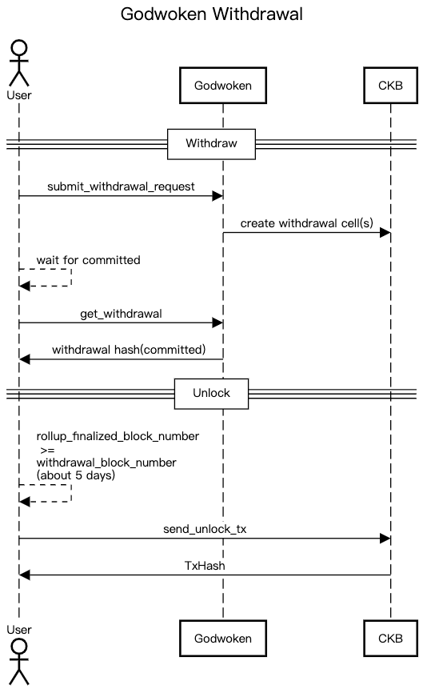

# How to Withdraw Asset from Godwoken(Layer 2) to CKB(Layer 1)

- basic knowledge of [godwoken](https://www.nervos.org/godwoken) layer 2 network
- basic knowledge of [ckb](https://docs.nervos.org/docs/basics/introduction) and ckb [transaction](https://docs.nervos.org/docs/reference/transaction)

There are two steps withdrawing assets from a layer 2 address to a layer 1 address.



### Step 1. Submit Withdrawal Request to Godwoken

The first step is to call [gw_submit_withdrawal_request](https://github.com/nervosnetwork/godwoken/blob/develop/docs/RPC.md#method-gw_submit_withdrawal_request) RPC method to burn assets on layer 2 chain
and in the meantime, Godwoken creates the assets on layer 1 which can later be unlocked by the receiver address.
Note that when making such a request you need to provide some info as parameters,

```json5
{
  raw: {
    nonce: "0x2e", // from [get_nonce](https://github.com/nervosnetwork/godwoken/blob/develop/docs/RPC.md#method-gw_get_nonce)
    capacity: "0x9502f9000", // amount of ckb to withdraw in shannon unit
    amount: "0x0", // amount of sUDT to withdraw, default to 0x0 if you don't need to withdraw sUDT
    sudt_script_hash: "0x0000000000000000000000000000000000000000000000000000000000000000", // l1 SUDT script hash, default to all zero if you don't need to withdraw sUDT
    account_script_hash: "0x1ddfd18bee966192f8e35e8fbaaae93b88c476960754077d039cf1e56c633c22", // withdrawer layer 2 ckb account lock hash, layer 2 address -> layer 2 lock script -> lock hash
    sell_amount: "0x0", // TODO unimplemented, selling price of the withdrawal cell in CKB
    sell_capacity: "0x0", // TODO unimplemented, selling price of the withdrawal cell in SUDT
    owner_lock_hash: "0xfda77156f5ec403242a03875b2b29e14ba1c910b14a62fbe0baa3e367ae1f0a6", // owner ckb account lock hash, layer 1 address -> lock script -> lock hash
    payment_lock_hash: "0x0000000000000000000000000000000000000000000000000000000000000000", // TODO unimplemented, layer1 lock to receive the payment, must exists on the chain
    fee: {
      sudt_id: "0x1",
      amount: "0x0",
    },
  },
  signature: "0x8109666e73e8e2ce0bc95d95e08a3a77844c9c5e8049882d863c765843f14af57107bf22c00bce8ea1e45cdbc85415d4f497061913bcbfa97258b2b27897a53a01",
}
```

### `owner_lock_hash` And `account_script_hash`

In the example above

- `owner_lock_hash`'s `owner` indicates the owner of layer 1
- `account_script_hash`'s `account` indicates the `address` of layer 2

To calc the hashes, we can see the sample code below

```ts
import { utils, helpers } from "@ckb-lumos/lumos";

// layer 1 receiver lock
const ownerLock = helpers.parseAddress(owner /* a CKB address like ckt1... */);
const owner_lock_hash = utils.computeScriptHash(ownerLock);

// layer 2 account
const l2AccountScript: Script = {
  code_hash: ethAccountTypeHash,
  hash_type: "type",
  args: rollupTypeHash + l2Address.slice(2),
};
const account_script_hash = utils.computeScriptHash(l2AccountScript);
```

Once you have successfully submitted the RPC request, the return hash value can be used to query the state of withdrawal by calling [gw_get_withdrawal](https://github.com/nervosnetwork/godwoken/blob/develop/docs/RPC.md#method-gw_get_withdrawal) method:

```JSON
{
  "id": 2,
  "jsonrpc": "2.0",
  "method": "gw_get_withdrawal",
  "params": ["0xb57c6da2f803413b5781f8c6508320a0ada61a2992bb59ab38f16da2d02099c1"]
}
```

the return value should look like:

<details>
  <summary markdown="span">return value of gw_get_withdrawal</summary>

```JSON
{
  "jsonrpc": "2.0",
  "id": 2,
  "result": {
    "withdrawal": {
      "raw": {
        "nonce": "0x2e",
        "capacity": "0x9502f9000",
        "amount": "0x0",
        "sell_amount": "0x0",
        "sell_capacity": "0x0",
        "sudt_script_hash": "0x0000000000000000000000000000000000000000000000000000000000000000",
        "account_script_hash": "0x1ddfd18bee966192f8e35e8fbaaae93b88c476960754077d039cf1e56c633c22",
        "owner_lock_hash": "0xfda77156f5ec403242a03875b2b29e14ba1c910b14a62fbe0baa3e367ae1f0a6",
        "payment_lock_hash": "0x0000000000000000000000000000000000000000000000000000000000000000",
        "fee": {
          "sudt_id": "0x1",
          "amount": "0x0"
        }
      },
      "signature": "0x8109666e73e8e2ce0bc95d95e08a3a77844c9c5e8049882d863c765843f14af57107bf22c00bce8ea1e45cdbc85415d4f497061913bcbfa97258b2b27897a53a01"
    },
    "status": "committed"
  }
}
```

</details>

The `status` field could be `pending` or `committed`, indicating the different status of the withdrawal.

Then a cell containing the assets is created on layer 1, to list all withdrawal cells requested by a layer 2 account, let's name it `AliceL2`, we can make a query using `@ckb-lumos/ckb-indexer` like this:

```ts
const getWithdrawalCellSearchParams = function (AliceL2: string) {
  const layer2Lock: Script = {
    code_hash: SCRIPTS.eth_account_lock.script_type_hash,
    hash_type: "type",
    args: ROLLUP_CONFIG.rollup_type_hash + AliceL2.slice(2).toLowerCase(),
  };
  const accountScriptHash = utils.computeScriptHash(layer2Lock);

  return {
    script: {
      code_hash: SCRIPTS.withdrawal_lock.script_type_hash,
      hash_type: "type" as HashType,
      args: `${ROLLUP_CONFIG.rollup_type_hash}${accountScriptHash.slice(2)}`,
    },
    script_type: "lock",
  };
};
const searchParams = getWithdrawalCellSearchParams(AliceL2);
const collector = ckbIndexer.collector({ lock: searchParams.script });
```

### Step 2. Unlock Withdrawal Cells

The second step is to unlock the asset created in step one, it needs to take some time(about 5 days) before one can unlock the assets for safety reasons.
We will support fast withdrawal in near future. When the waiting time is due, the receiver address can make a layer 1 transaction to unlock the asset cell,
the transaction should take the withdrawal cell as input and another ckb cell to pay the transaction fee, in the output withdraw cell, just change the lock of the asset cell to the receiver lock.


Here is an example:

<details>
  <summary markdown="span">example</summary>

```json5
{
  version: "0x0",
  cell_deps: [
    {
      // withdraw cell dep
      out_point: {
        tx_hash: "0xb4b07dcd1571ac18683b515ada40e13b99bd0622197b6817047adc9f407f4828",
        index: "0x0",
      },
      dep_type: "code",
    },
    {
      // rollup cell dep
      out_point: {
        tx_hash: "0x6ab0949b8ce8e7b268d12848c2668a049c3c0ac0d5e803311dd2512c96ce3072",
        index: "0x0",
      },
      dep_type: "code",
    },
    {
      // omni lock cell dep
      out_point: {
        tx_hash: "0x9154df4f7336402114d04495175b37390ce86a4906d2d4001cf02c3e6d97f39c",
        index: "0x0",
      },
      dep_type: "code",
    },
    {
      // secp256k1 cell dep
      out_point: {
        tx_hash: "0xf8de3bb47d055cdf460d93a2a6e1b05f7432f9777c8c474abf4eec1d4aee5d37",
        index: "0x0",
      },
      dep_type: "dep_group",
    },
  ],
  header_deps: [],
  inputs: [
    {
      // withdrawal cell
      since: "0x0",
      previous_output: {
        index: "0x27",
        tx_hash: "0xfd6b226ca0cf63860b6958b75c498d44d780b273b9a5dd5563925dfb99c7b2d8",
      },
    },
    {
      // owner cell
      since: "0x0",
      previous_output: {
        index: "0x0",
        tx_hash: "0xe68156b56efe7da6143a4f4c6b1fd6e57cad34d5677a3eb2ebe0ab4a5a8b8c07",
      },
    },
  ],
  outputs: [
    {
      // with changing the lock of withdrawal cell to owner lock, the assets is unlocked by owner
      capacity: "0xba43b7400",
      lock: {
        code_hash: "0x79f90bb5e892d80dd213439eeab551120eb417678824f282b4ffb5f21bad2e1e",
        hash_type: "type",
        args: "0x01a08bcc398854db4eaffd9c28b881c65f91e3a28b00",
      },
      type: null,
    },
    {
      // owner cell exchange after paying tx fee
      capacity: "0x95623ea60",
      lock: {
        code_hash: "0x79f90bb5e892d80dd213439eeab551120eb417678824f282b4ffb5f21bad2e1e",
        hash_type: "type",
        args: "0x01a08bcc398854db4eaffd9c28b881c65f91e3a28b00",
      },
    },
  ],
  outputs_data: ["0x", "0x"],
  witnesses: ["0x1c000000100000001c0000001c000000080000000000000004000000", "..."],
}
```

</details>

#### Cell Dependencies

The `cell_deps` should contain `rollup cellDep`, `lock cellDep` and `withdraw cellDep`. Remember to add `sudt cellDep` if you have any SUDT withdrawn, then other `cellDep`s required by the receiver lock. You can get `withdraw cellDep` and `sudt cellDep` from some static config file, `lock cellDep` depends on which lock you would use, we use Omni-lock in the example, so we added `Omni-lock cellDep`. `rollup cellDep` should be obtained from mem pool:

```ts
async function getRollupCellDep(): Promise<CellDep> {
  const result = await this.godwokenClient.getLastSubmittedInfo();
  const txHash = result.transaction_hash;
  const tx = await this.getPendingTransaction(txHash);

  if (tx == null) {
    throw new Error("Last submitted tx not found!");
  }

  let rollupIndex = tx.transaction.outputs.findIndex((o: any) => {
    return o.type && utils.computeScriptHash(o.type) === ROLLUP_CONFIG.rollup_type_hash;
  });
  return {
    out_point: {
      tx_hash: txHash,
      index: `0x${rollupIndex.toString(16)}`,
    },
    dep_type: "code",
  };
}
```

## Reference:

- [Godwoken Docs](https://github.com/nervosnetwork/godwoken/blob/develop/docs/RPC.md#method-gw_submit_withdrawal_request)
- [More Godwoken Demos](https://github.com/classicalliu/gw-demos)
- [Godwoken testnet config](https://github.com/nervosnetwork/godwoken-public/blob/master/testnet/config/scripts-deploy-result.json)
- [Polyjuice Provider](https://github.com/nervosnetwork/polyjuice-provider)
- [Godwoken Web3](https://github.com/nervosnetwork/godwoken-web3#godwoken-web3-api) A Web3 RPC compatible layer build upon Godwoken/Polyjuice.
- [lumos](https://github.com/nervosnetwork/lumos) A library for building dAPP on CKB
