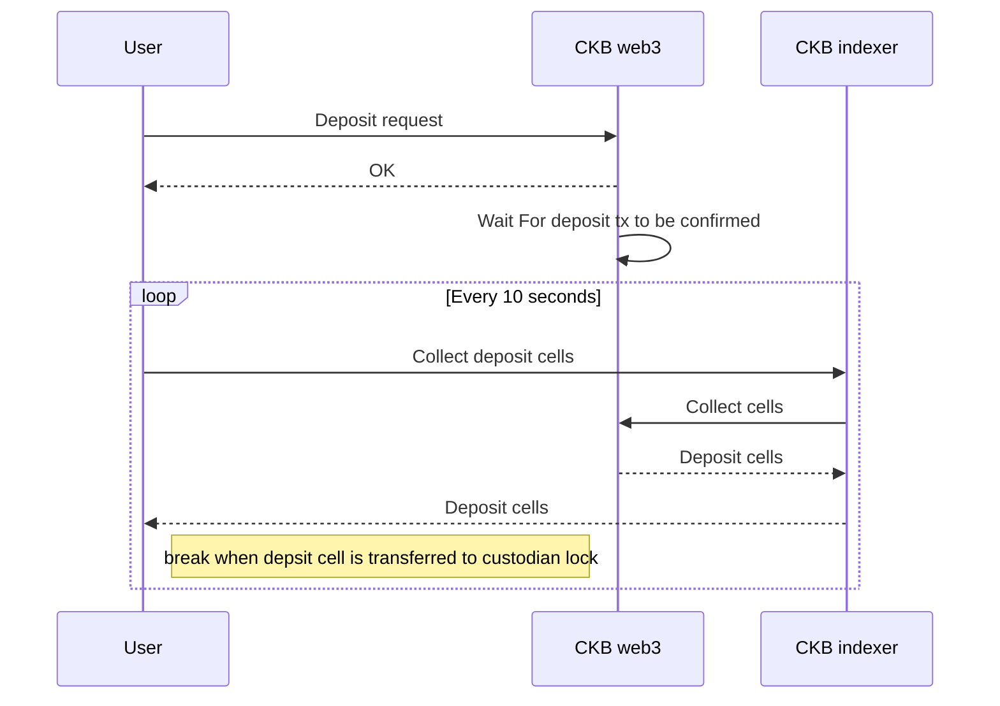
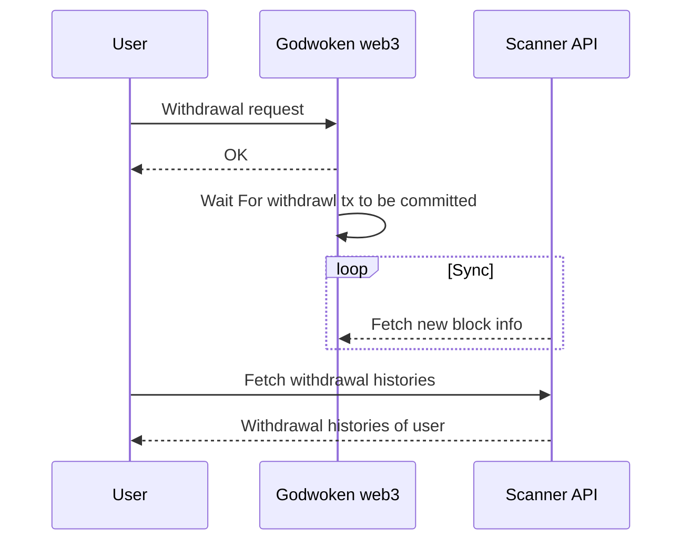

# About Godwoken Bridge

## Table of Contents

- [About Godwoken Bridge](#about-godwoken-bridge)
  - [Table of Contents](#table-of-contents)
  - [Introduction to Godwoken Bridge](#introduction-to-godwoken-bridge)
    - [Mainnet](#mainnet)
    - [Testnet](#testnet)
  - [Functionalities](#functionalities)
    - [Deposit](#deposit)
      - [Deposit Diagram](#deposit-diagram)
      - [How does deposit work](#how-does-deposit-work)
      - [Link to Godwoken Deposit docs](#link-to-godwoken-deposit-docs)
    - [Withdrawal](#withdrawal)
      - [Withdrawal Diagram](#withdrawal-diagram)
      - [How does withdrawal work](#how-does-withdrawal-work)
        - [How to make a withdrawal request](#how-to-make-a-withdrawal-request)
        - [How to fetch withdrawal list](#how-to-fetch-withdrawal-list)
          - [Scanner API docs](#scanner-api-docs)
      - [Link to Godwoken withdrawal docs](#link-to-godwoken-withdrawal-docs)
  - [References](#references)

## Introduction to Godwoken Bridge

Godwoken Bridge is a token bridge between CKB layer 1 network and Godwoken layer 2 network.

### Mainnet

- https://mainnet.bridge.godwoken.io/

### Testnet

- https://testnet.bridge.godwoken.io/

## Functionalities

### Deposit

By depositing assets, it means moving your token assets from CKB layer 1 network to Godwoken layer 2 network.

#### Deposit Diagram



#### How does deposit work

All you need to do is to forge a tx to transfer assets to this deposit lock:

```json5
{
  "code_hash": <deposit lock code_hash>
  "hash_type": <deposit lock hash_type>
  "args": <Your deposit lock args>
}
```

The deposit lock args structure is declared [here](https://github.com/nervosnetwork/godwoken/blob/develop/crates/types/schemas/godwoken.mol#L175-L183) as:

```json5
// --- deposit lock ---
// a rollup_type_hash exists before this args, to make args friendly to prefix search
table DepositLockArgs {
    // layer1 lock hash
    owner_lock_hash: Byte32,
    layer2_lock: Script,
    cancel_timeout: Uint64, // v0/v1 has different min cancel_timeout, please refer to godwoken docs
    registry_id: Uint32, // only v1
}
```

#### Link to Godwoken Deposit docs

For more infomation about deposit, please refer to Godwoken docs:

- https://docs.godwoken.io/depAndWthd#deposit

### Withdrawal

By withdrawing assets, it means moving your token assets from Godwoken layer 2 network back to CKB layer 1 network.

#### Withdrawal Diagram



#### How does withdrawal work

##### How to make a withdrawal request

The first step is to call [gw_submit_withdrawal_request](https://github.com/nervosnetwork/godwoken/blob/develop/docs/RPC.md#method-gw_submit_withdrawal_request) RPC method to burn assets on layer 2 chain
and in the meantime, Godwoken creates the assets on layer 1 which can later be unlocked by the receiver address.
Note that when making such a request you need to provide some info as parameters,

```json5
{
  raw: {
    nonce: "0x2e", // from [get_nonce](https://github.com/nervosnetwork/godwoken/blob/develop/docs/RPC.md#method-gw_get_nonce)
    capacity: "0x9502f9000", // amount of ckb to withdraw in shannon unit
    amount: "0x0", // amount of sUDT to withdraw, default to 0x0 if you don't need to withdraw sUDT
    sudt_script_hash: "0x0000000000000000000000000000000000000000000000000000000000000000", // l1 SUDT script hash, default to all zero if you don't need to withdraw sUDT
    account_script_hash: "0x1ddfd18bee966192f8e35e8fbaaae93b88c476960754077d039cf1e56c633c22", // withdrawer layer 2 ckb account lock hash, layer 2 address -> layer 2 lock script -> lock hash
    sell_amount: "0x0", // TODO unimplemented, selling price of the withdrawal cell in CKB
    sell_capacity: "0x0", // TODO unimplemented, selling price of the withdrawal cell in SUDT
    owner_lock_hash: "0xfda77156f5ec403242a03875b2b29e14ba1c910b14a62fbe0baa3e367ae1f0a6", // owner ckb account lock hash, layer 1 address -> lock script -> lock hash
    payment_lock_hash: "0x0000000000000000000000000000000000000000000000000000000000000000", // TODO unimplemented, layer1 lock to receive the payment, must exists on the chain
    fee: {
      sudt_id: "0x1",
      amount: "0x0",
    },
  },
  signature: "0x...",
}
```

##### How to fetch withdrawal list

The Scanner API provides a method to fetch withdrawals list.

```sh
curl --location --request GET 'https://api.aggron.gwscan.com/api/withdrawal_histories?owner_lock_hash=<Your Owner Lock Hash>'
```

###### Scanner API docs

Godwoken Scanner API docs can be found here:

- https://github.com/Magickbase/ckb-wallet-and-explorer/wiki/Godwoken-Explorer

#### Link to Godwoken withdrawal docs

For more infomation about withdraw, please refer to Godwoken docs:

- https://docs.godwoken.io/depAndWthd#withdrawal
- https://github.com/nervosnetwork/godwoken/blob/develop/docs/RPC.md#method-gw_submit_withdrawal_request

## References

- [More Godwoken Demos](https://github.com/classicalliu/gw-demos)
- [Godwoken config info](https://github.com/nervosnetwork/godwoken-info/)
- [Polyjuice Provider](https://github.com/nervosnetwork/polyjuice-provider)
- [Godwoken Web3](https://github.com/nervosnetwork/godwoken-web3#godwoken-web3-api) A Web3 RPC compatible layer build upon Godwoken/Polyjuice.
- [lumos](https://github.com/nervosnetwork/lumos) A library for building dAPP on CKB