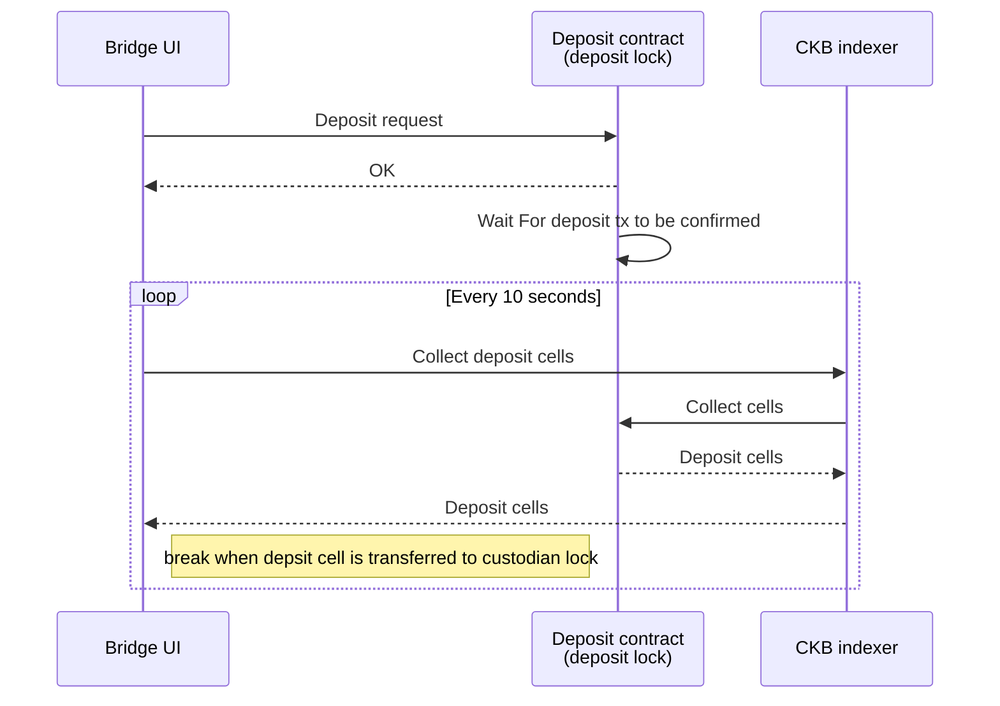
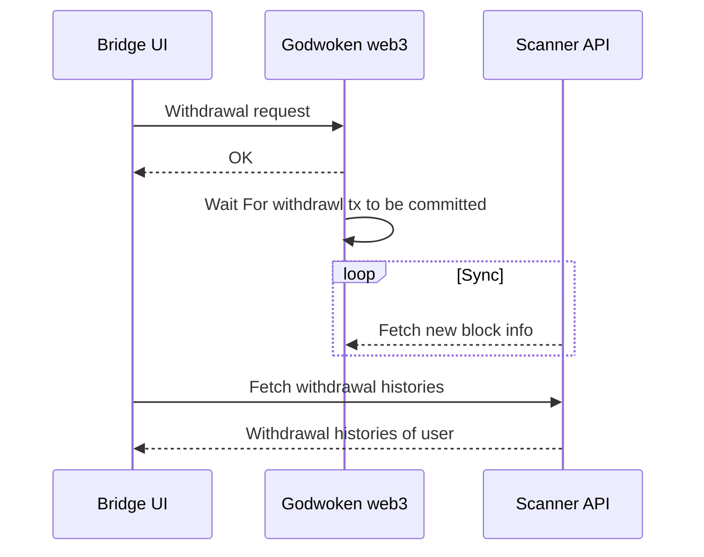

# About Godwoken Bridge

## Introduction to Godwoken Bridge

Godwoken Bridge is a token bridge between CKB layer 1 network and Godwoken layer 2 network.

### Mainnet

- https://mainnet.bridge.godwoken.io/

### Testnet

- https://testnet.bridge.godwoken.io/

## Functionalities

### Deposit

By depositing assets, it means moving your token assets from CKB layer 1 network to Godwoken layer 2 network.

#### Deposit Diagram



#### How does deposit work

##### How to make a deposit request

All you need to do is to forge a tx to transfer assets to this deposit lock:

```json5
{
  "code_hash": "<deposit lock code_hash>",
  "hash_type": "<deposit lock hash_type>",
  "args": "<Your deposit lock args>"
}
```

The deposit lock args structure is declared [here](https://github.com/nervosnetwork/godwoken/blob/develop/crates/types/schemas/godwoken.mol#L175-L183) as:

```json5
// --- deposit lock ---
// a rollup_type_hash exists before this args, to make args friendly to prefix search
table DepositLockArgs {
    // layer1 lock hash
    owner_lock_hash: Byte32,
    layer2_lock: Script,
    cancel_timeout: Uint64, // v0/v1 has different min cancel_timeout, please refer to godwoken docs
    registry_id: Uint32, // only v1
}
```

##### How to fetch deposit result

The user needs to collect deposit cells from the CKB indexer. When the user got a deposit cell from the indexer, and the deposit cell status is dead and transferred to the custodian lock, that means the deposit is successful.

After making a deposit request and getting a transaction hash, the user can track the deposit result by CKB explorer:

- [mainet](https://explorer.nervos.org/)
- [testnet](https://pudge.explorer.nervos.org/)

Just search by the transaction hash, and you can find the deposit cell.

#### Link to Godwoken Deposit docs

For more infomation about deposit, please refer to Godwoken docs:

- https://docs.godwoken.io/depAndWthd#deposit

### Withdrawal

Withdrawal means moving the user's assets from the Godwoken layer 2 network back to the CKB layer 1 network.

#### Withdrawal Diagram



#### How does withdrawal work

##### How to make a withdrawal request

The first step is to call [gw_submit_withdrawal_request](https://github.com/nervosnetwork/godwoken/blob/develop/docs/RPC.md#method-gw_submit_withdrawal_request) RPC method to burn assets on layer 2 chain
and in the meantime, Godwoken creates the assets on layer 1 which can later be unlocked by the receiver address.
Note that when making such a request you need to provide some info as parameters,

```json5
{
  raw: {
    nonce: "0x2e", // from [get_nonce](https://github.com/nervosnetwork/godwoken/blob/develop/docs/RPC.md#method-gw_get_nonce)
    capacity: "0x9502f9000", // amount of ckb to withdraw in shannon unit
    amount: "0x0", // amount of sUDT to withdraw, default to 0x0 if you don't need to withdraw sUDT
    sudt_script_hash: "0x0000000000000000000000000000000000000000000000000000000000000000", // l1 SUDT script hash, default to all zero if you don't need to withdraw sUDT
    account_script_hash: "0x1ddfd18bee966192f8e35e8fbaaae93b88c476960754077d039cf1e56c633c22", // withdrawer layer 2 ckb account lock hash, layer 2 address -> layer 2 lock script -> lock hash
    sell_amount: "0x0", // TODO unimplemented, selling price of the withdrawal cell in CKB
    sell_capacity: "0x0", // TODO unimplemented, selling price of the withdrawal cell in SUDT
    owner_lock_hash: "0xfda77156f5ec403242a03875b2b29e14ba1c910b14a62fbe0baa3e367ae1f0a6", // owner ckb account lock hash, layer 1 address -> lock script -> lock hash
    payment_lock_hash: "0x0000000000000000000000000000000000000000000000000000000000000000", // TODO unimplemented, layer1 lock to receive the payment, must exists on the chain
    fee: {
      sudt_id: "0x1",
      amount: "0x0",
    },
  },
  signature: "0x...",
}
```

##### How to fetch withdrawal list

The Scanner API provides a method to fetch withdrawals list.

```sh
curl --location --request GET 'https://api.aggron.gwscan.com/api/withdrawal_histories?owner_lock_hash=<Your Owner Lock Hash>'
```

###### Scanner API docs

Godwoken Scanner API docs can be found here:

- https://github.com/Magickbase/ckb-wallet-and-explorer/wiki/Godwoken-Explorer

#### Link to Godwoken withdrawal docs

For more infomation about withdraw, please refer to Godwoken docs:

- https://docs.godwoken.io/depAndWthd#withdrawal
- https://github.com/nervosnetwork/godwoken/blob/develop/docs/RPC.md#method-gw_submit_withdrawal_request

## References

- [More Godwoken Demos](https://github.com/classicalliu/gw-demos)
- [Godwoken config info](https://github.com/nervosnetwork/godwoken-info/)
- [Polyjuice Provider](https://github.com/nervosnetwork/polyjuice-provider)
- [Godwoken Web3](https://github.com/nervosnetwork/godwoken-web3#godwoken-web3-api) A Web3 RPC compatible layer build upon Godwoken/Polyjuice.
- [lumos](https://github.com/nervosnetwork/lumos) A library for building dAPP on CKB

## Known Issues

1. If you are a new user of Godwoken network, you may encounter some unkonwn errors on Godwoken Bridge page, this is because that your account is not registered on Godwoken network. Just deposit some CKB to Godwoken network, the problems will be gone.
