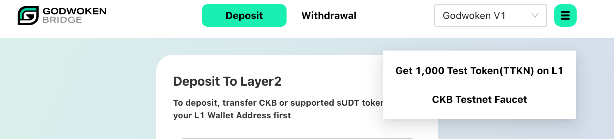

# How to get test tokens

You can get our test sudt token: TTKN, and CKB test token on Godwoken Bridge:

Or get ERC20 test token from [Glias Faucet](https://gliaswap-faucet-rinkeby.ckbapp.dev/) on Rinkeby network, and then bridge it to CKB testnet via [Force Bridge Testnet](https://testnet.forcebridge.com/).
