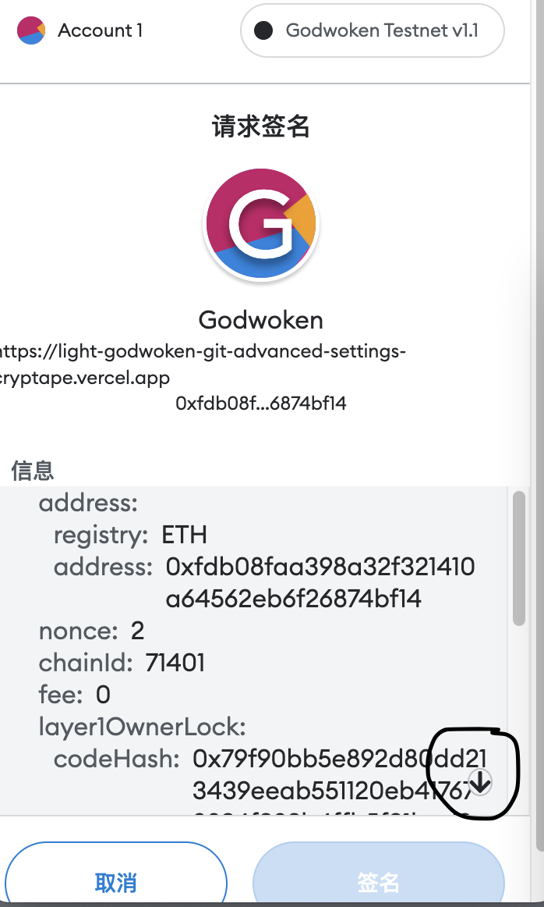
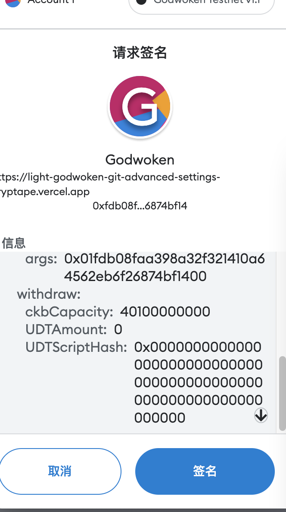

### Withdrawal Signing with Metamsk

When you are trying to withdrww your CKB or sUDT from L2 to L1, you may find the `Sign` button on Metamask is grey and not clickable. You have to click the small downside arraw in Metamask first, then the `Sign` button will become blue and clickable.

**Click this arrow**

 

**Sign button becomes blue**

